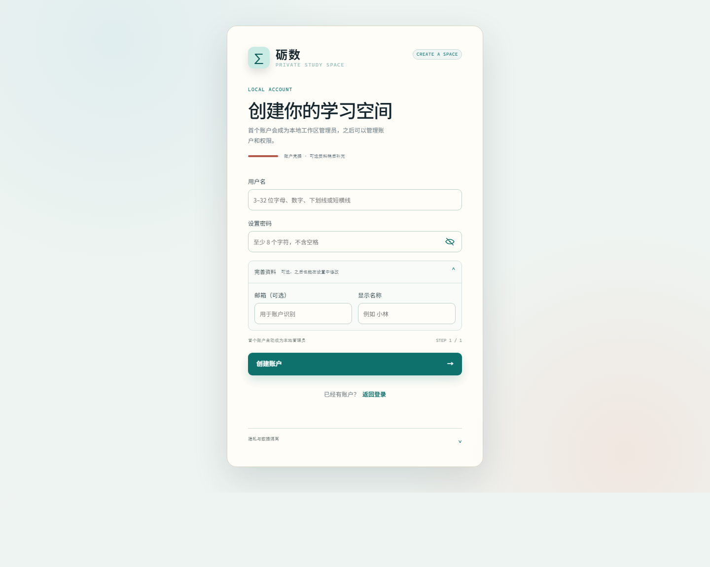
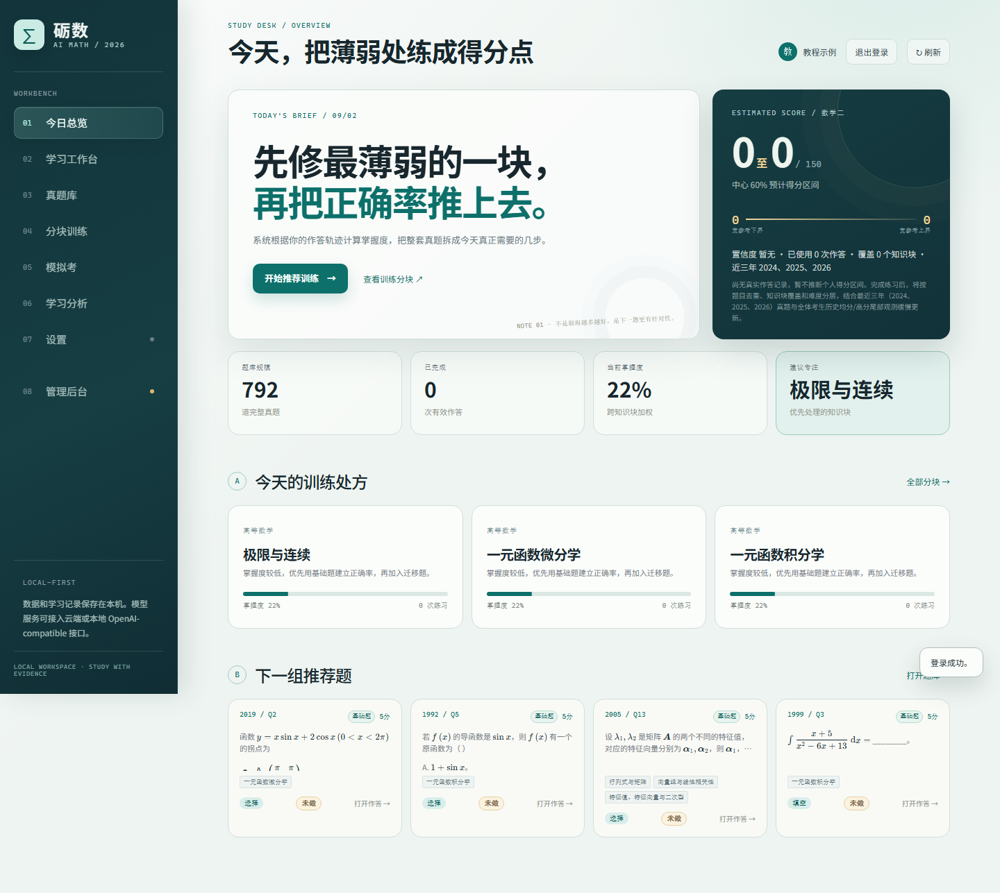
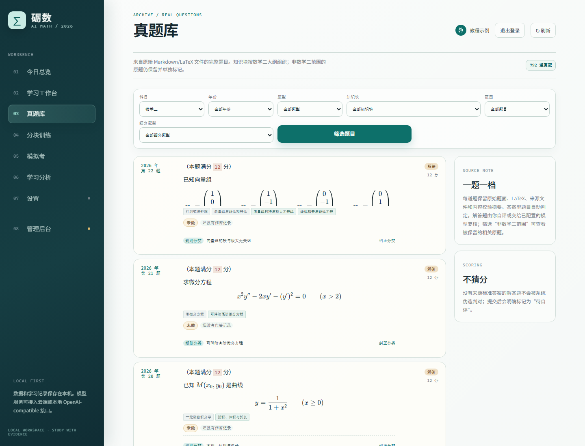
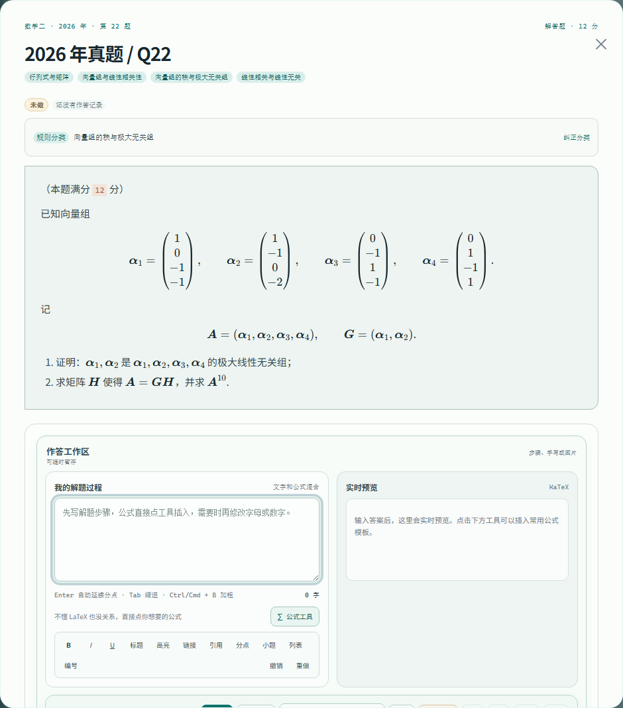
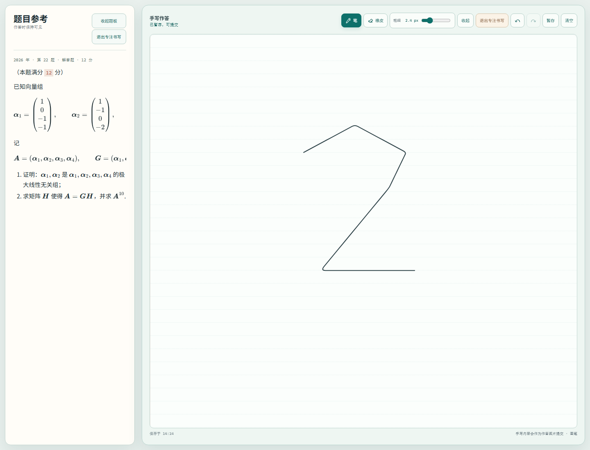
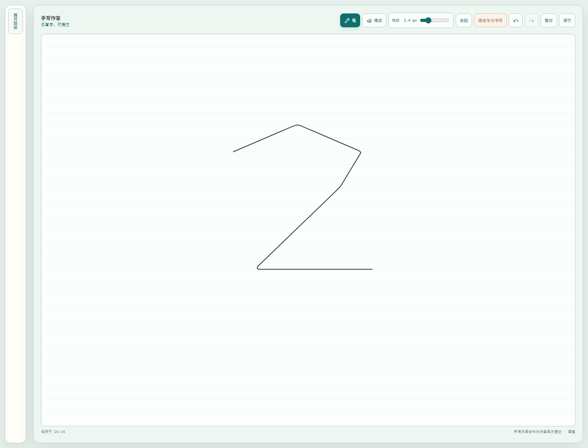
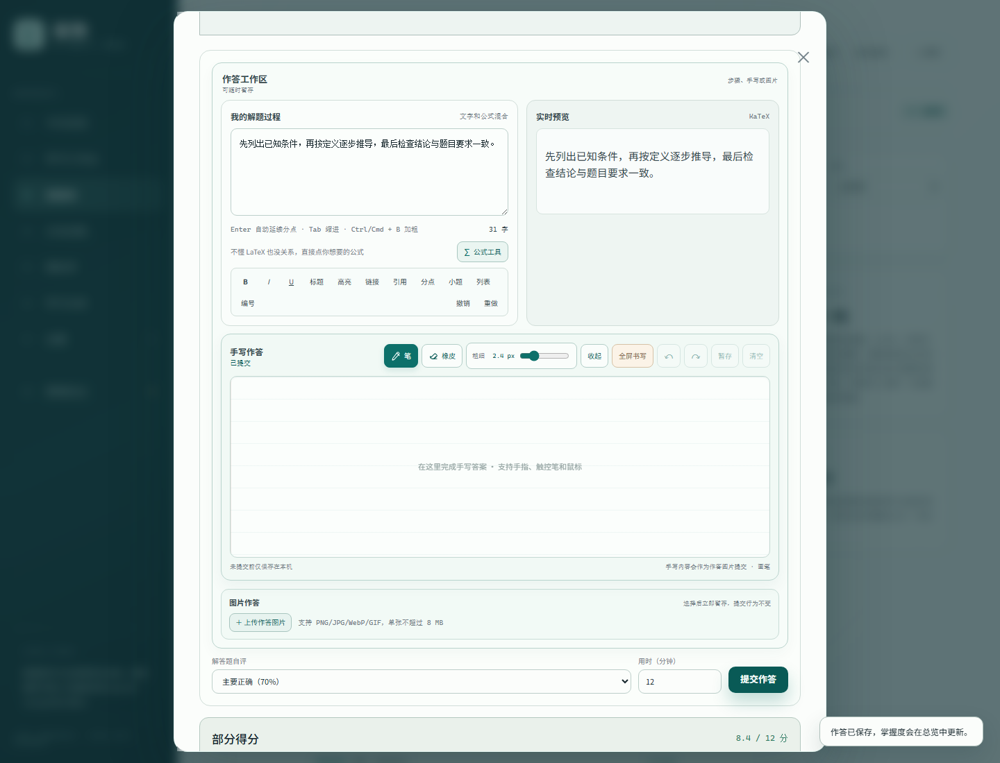
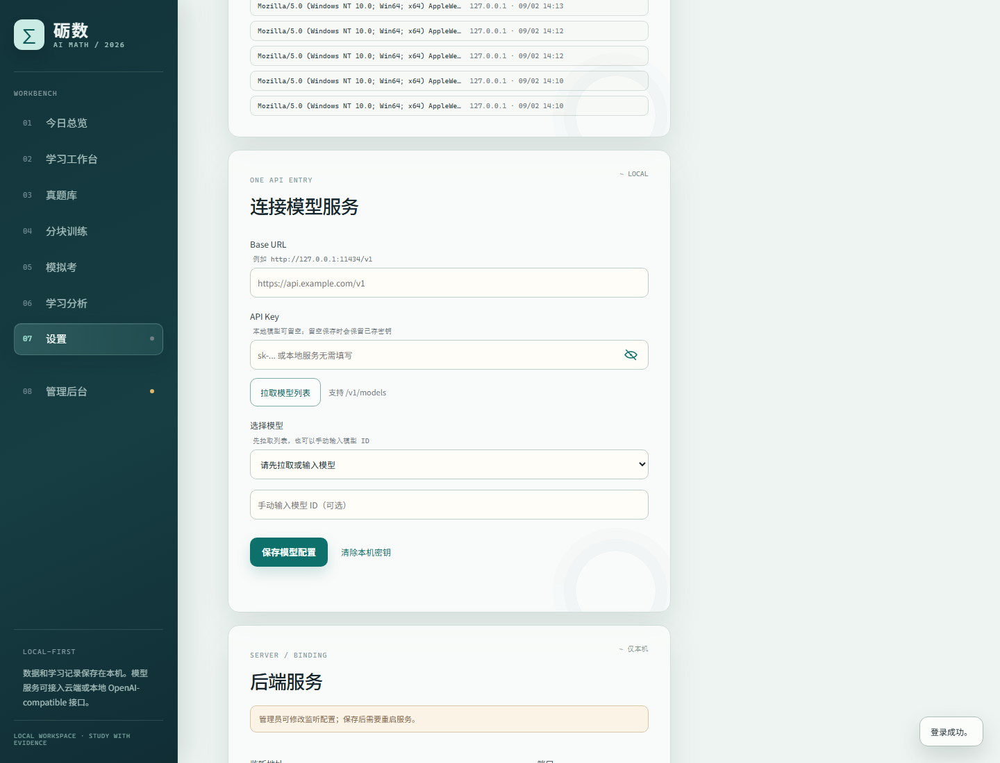
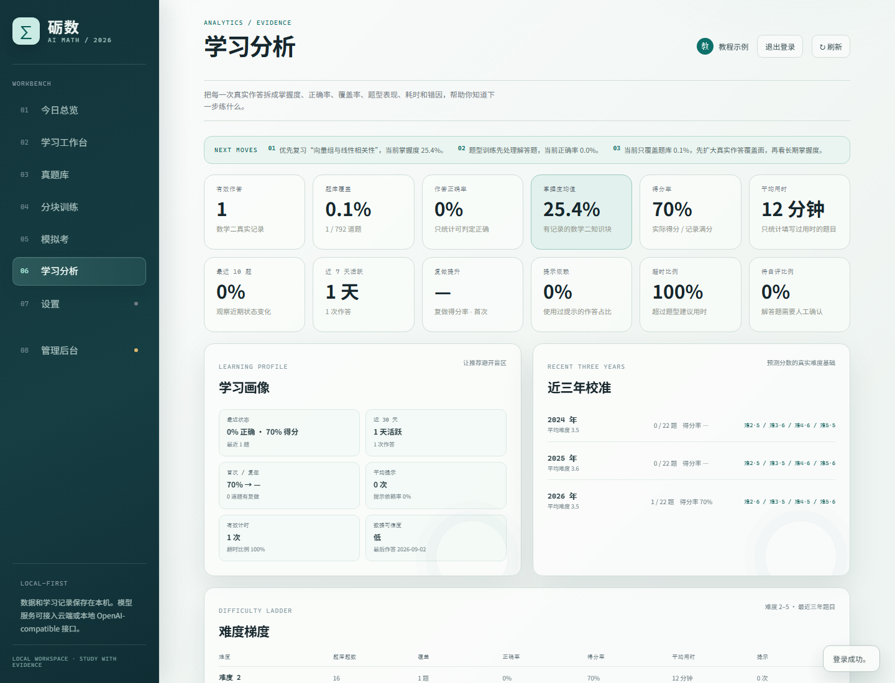

# 砺数使用教程

这是一份可以照着操作的完整教程：从第一次启动，到筛选一道真题、用文字或手写作答、提交、查看复核结果，再到学习分析。截图来自实际运行的本地页面；截图中的账户名称只是演示文字，你自己的题目记录和模型配置仍然只保存在自己的本机账户中。

## 先记住三件事

1. **先启动服务，再打开浏览器。** 终端窗口要保持运行，关闭它就等于停止本地服务。
2. **先练再看分析。** 没有真实作答时，分数预估显示 `0 至 0` 是正常的，不是题库丢失。
3. **API Key 只放在“设置”里。** 它会保存在本机数据库，不能放进截图、README、网盘或 Git 提交。

如果只想快速走一遍主流程：启动服务 → 注册账户 → 打开“真题库” → 点开题目 → 作答（文字/公式/手写均可）→ “提交作答” → 查看结果。

## 1. 启动本地服务

在 PowerShell 中进入项目根目录。第一次使用时执行：

```powershell
python -m venv .venv
.\.venv\Scripts\Activate.ps1
python -m pip install -r requirements.txt
python scripts/import_questions.py
python scripts/run_server.py
```

如果 PowerShell 不允许激活脚本，可以直接使用虚拟环境里的 Python：

```powershell
.\.venv\Scripts\python.exe -m pip install -r requirements.txt
.\.venv\Scripts\python.exe scripts/import_questions.py
.\.venv\Scripts\python.exe scripts/run_server.py
```

看到类似 `Uvicorn running on http://127.0.0.1:8000` 后，在浏览器打开 <http://127.0.0.1:8000>。启动脚本会按自己的目录定位项目，从其他目录启动时也可以传入脚本完整路径。需要停止服务时回到终端按 `Ctrl+C`，不要直接关闭浏览器来代替停止服务。

题库导入只读取真实存在的 Markdown/LaTeX 源文件；如果题目列表为空，先确认导入脚本执行完成，再刷新页面。

## 2. 创建第一个账户

第一次打开会进入账户页面。点击“注册新账户”，填写：

- 用户名：3–32 位字母、数字、下划线或短横线。
- 密码：至少 8 个字符，不要包含空格。
- “完善资料”里的邮箱和显示名称是可选项，之后也能在“设置”中修改。

第一个注册账户会自动获得本地管理员权限，后续账户只能看到自己的作答、训练、笔记和模型配置。注册完成后，页面会自动进入学习空间。



图中“完善资料”已经展开。实际注册时不需要填写邮箱；如果不希望留下额外资料，用户名和密码两项就够了。

## 3. 先看“今日总览”

登录后默认进入“今日总览”。这里的四块核心信息分别是：题库规模、已完成作答、当前掌握度和建议专注的知识块。



使用建议：

1. 先看“建议专注”，它来自你的真实作答证据，不是随机励志文案。
2. 想直接开始练习，点击“开始推荐训练”；想自己挑题，进入“真题库”。
3. 总览里的推荐题卡可以直接点“打开作答”。
4. 刚注册时没有个人记录，所以“已完成”为 0、预估分为 0 至 0，都属于正常初始状态。

左侧导航的含义如下：

| 入口 | 用途 |
| --- | --- |
| 今日总览 | 查看今天的训练建议、预估区间和推荐题 |
| 学习工作台 | 查看知识块模板、题型方法和笔记 |
| 真题库 | 按年份、题型、知识块和范围找题 |
| 分块训练 | 围绕一个知识块或具体考法连续练习 |
| 模拟考 | 按真实年份生成整卷并计时 |
| 学习分析 | 查看掌握度、覆盖率、正确率和薄弱项 |
| 设置 | 账户、学习偏好、模型和服务配置 |

## 4. 在真题库筛选题目

点击“真题库”后，先用筛选器缩小范围：

1. “科目”选择数学二。
2. 需要练近年题时选择“年份”；想练某种形式时选择“题型”。
3. 先选“知识块”，再选“细分题型”，可以把范围缩到一个具体考法。
4. “范围”选择“数学二大纲内”可隐藏被保留但不属于数学二范围的原题。
5. 点击“筛选题目”，然后点任意题卡进入作答。



题目卡会保留来源题面、题型、分值、知识块和作答状态。题面中的公式按 LaTeX 渲染；不要把题目截图当成唯一来源，遇到疑问可以在题目弹窗底部查看来源路径和来源解析。

## 5. 文字、公式和图片作答

打开题目后，先读完题面，再进入“作答工作区”。解答题的文字区叫“我的解题过程”，右侧是“实时预览”。



### 5.1 写文字和公式

- 普通文字直接输入，Enter 会按编辑器规则换行。
- 点击“公式工具”可以插入常见的行列式、积分、极限、矩阵等模板，再把占位内容替换成自己的式子。
- 行内公式使用 `$...$`，独立公式使用 `$$...$$`；输入后右侧会立即显示排版效果。
- 工具栏的加粗、斜体、标题、引用、分点、小题、列表、撤销和重做只作用于当前答题区，不会改动原题。

选择题和填空题会出现对应的答案控件；解答题还会出现“解答题自评”。如果暂时不想给自己估分，保持“暂不自评”即可，系统会诚实记录为待自评，不会猜分。

### 5.2 图片作答

点击“上传作答图片”选择 PNG、JPG、WebP 或 GIF。单张图片不超过 8 MB，上传完成后会显示在当前作答区；提交时图片会和文字答案绑定到同一道题。

图片建议：只拍答题纸，不要拍到身份证、API Key、浏览器密码管理器或其他无关隐私。图片太大时先在本地裁剪，不要把图片上传到公共图床再粘贴链接。

### 5.3 用时和草稿

在“用时（分钟）”中填写本题实际耗时。切换题目或关闭弹窗前，文字和手写草稿会先保存在本机；只有点击“提交作答”后，才会写入正式学习记录并影响掌握度。

## 6. 手写答题板

手写区支持鼠标、触控板、触屏和触控笔。工具栏从左到右包括：笔、橡皮、粗细、收起/展开、全屏书写、撤销、重做、暂存和清空。



### 6.1 全屏时仍然看得到题目

点击“全屏书写”后，题目会固定在左侧的“题目参考”面板，手写画布占据主要空间。题板已经尽量压缩，只保留能读清题目的宽度：

1. 题目太占地方时，点击左侧“收起题板”。
2. 收起后左侧只剩一个窄按钮“展开题板”。
3. 需要核对条件、矩阵或公式时，再点击“展开题板”。
4. 写完点击“退出专注书写”，会回到题目弹窗，不会清空草稿。



### 6.2 笔、橡皮和粗细

- 点击“笔”后在画布上书写；光标会切换为笔形态。
- 点击“橡皮”后擦除经过的笔画；光标会切换为橡皮形态。
- 拖动“粗细”滑块，旁边的像素值和实际笔画会同步改变。
- 误写时优先点“撤销”；“重做”可以恢复刚撤销的笔画。
- “暂存”只保存到本机草稿，不会提前计入成绩。

手写内容提交时会自动生成 PNG 附件并关联到本题。即使没有输入文字，只要画布上确实有笔画，提交流程也会把这张手写图一起送入复核流程。

## 7. 提交作答与查看结果

确认答案、用时和（如需要）自评后，点击“提交作答”。提交按钮会暂时变为“正在提交…”，图片上传时会显示上传状态；不要连续点击，也不要在请求还没结束时刷新页面。



结果区常见状态：

- **判定正确**：选择题/填空题完成安全比对，或多模态复核确认正确。
- **需要订正**：答案与可判定标准答案不一致。
- **部分得分**：解答题使用了自评比例，系统按自评记录分数。
- **等待自评**：来源没有完整标准答案，系统不会假装自动判对。

结果下方会显示来源答案、来源解析和已提交附件。手写复核如果暂时没有完成，附件仍然会先保存，结果区会提示稍后点击“重新分析”。

### AI 复核时会看到什么

点击结果区的“重新分析”后，界面只显示“正在思考”，不会把模型内部思考过程混进最终答案。模型返回的长 JSON、Markdown 和 LaTeX 会分别按结构、段落和公式渲染；不需要手动复制到其他工具里排版。

模型只负责错因分析、手写识别和辅导建议；本地判题结果、原始题目和学习记录不会被模型直接篡改。模型响应较慢时先看按钮旁的状态，不要重复提交同一道题。

## 8. 连接模型服务

如果需要 AI 错因分析或手写识别，进入“设置”，向下滚动到“连接模型服务”。



按下面顺序填写：

1. **Base URL**：填写服务商提供的 OpenAI-compatible 地址，通常以 `/v1` 结尾。例如本机 Ollama 常用 `http://127.0.0.1:11434/v1`。
2. **API Key**：云服务填自己的密钥；本地 Ollama 或不要求密钥的服务可以留空。
3. 点击“拉取模型列表”，确认服务能返回 `/v1/models`。
4. 在“选择模型”中选一个模型；如果列表没有返回，也可以在“手动输入模型 ID”填写服务端真实存在的 ID。
5. 点击“保存模型配置”，回到题目重新分析一次。

API Key 只保存在本机 `data/ai_math.sqlite3`，页面只显示末四位掩码。不要把这个数据库、截图、浏览器导出文件或日志上传到公共仓库；不要在教程、Issue 或 README 中粘贴真实密钥。保存后如果连接徽标仍显示“未配置”，先检查 Base URL、模型 ID 和服务是否真的在监听。

## 9. 分块训练：一次专注一个考法

进入“分块训练”后，先打开一个知识块，再选择具体考法。每个分块会显示模板、题型策略、真实题例和学习进度。

1. 点击“开始训练”，系统从真实题库抽取一组题，最多 15 题。
2. 题目导航可以在组内切换；每道题的文字、公式、图片和手写草稿分别保留。
3. 卡住时可以点“问问 AI”看提示，也可以点“查看解析”看来源解析；提示不会自动提交答案。
4. 中途点击“保存暂存”只保存草稿，不改变掌握度。
5. 全部检查后点击“提交训练”，系统统一判题并把结果写入学习记录。

训练页与单题弹窗复用同一套答题区，所以在真题库里学会的公式工具、手写板和图片上传方式，在分块训练中完全相同。点击“换一组题”时会优先避开刚刚做过的题；题库不足时会明确提示回退范围。

## 10. 模拟考：按整卷节奏练习

进入“模拟考”，选择年份和时长，点击“生成整卷”。题目顺序、题面和分值来自题库，不使用占位题。

- 计时器会持续显示剩余时间，离开页面不会自动暂停。
- 每道题可以使用文字、公式、图片或手写作答。
- 解答题暂时不自评也可以交卷，会被记录为“待自评”，不会被系统猜分。
- 点击“提交整卷”后统一判题，成绩和每道题的作答会回流到学习分析。
- 时间结束时系统会自动提交；重新进入页面可以查看已完成试卷、答案和解析。

## 11. 学习分析：看证据，不看错觉

至少完成一次真实作答后，进入“学习分析”。页面会按真实记录计算有效作答、题库覆盖、正确率、得分率、平均用时、掌握度、题型表现、错因分布和近 30 天趋势。



阅读顺序建议：

1. 先看顶部“下一步建议”，知道今天先处理哪个知识块。
2. 再看“薄弱知识块”和“具体考法明细”，确认问题是在知识点、题型还是速度。
3. 查看“最近作答”和“提示依赖”，区分真正不会与只是第一次接触。
4. 最后看分数预估。一个知识块的少量题目不能代表整张试卷，覆盖面太窄时置信度会保持低。

系统只统计真实作答；没有记录时不会编造个人正确率、排名或学习趋势。

## 12. 学习工作台与笔记

“学习工作台”适合把一次作答沉淀成可复习的卡片：

- 左侧选择知识块，查看 68 类具体考法的识别信号、公式卡片、步骤和易错点。
- 点击真实题例可以直接进入作答，题型匹配不到时会明确显示空状态，不拿其他题型冒充。
- 新建笔记后可选择图文模式或 Markdown 模式；两种模式都能插入公式、图片、列表和小题。
- 保存后可以收藏、检索、按知识块归类，并在版本历史中回看旧内容。
- 工作台支持导出/导入学习数据；导出文件也要按个人资料谨慎保存，不要公开上传。

一个实用习惯是：提交错题后，先打开来源解析，再在工作台写三行复盘——“我在哪一步停住”“正确方法的第一步”“下次检查什么”。这样比只收藏答案更容易在下一次作答时复现。

## 13. 账户、服务和数据安全

“设置”里除了模型，还有账户资料、学习偏好、密码和服务监听配置：

- `127.0.0.1` 只允许本机访问，适合个人学习。
- `0.0.0.0` 允许局域网设备连接；对外使用前应配置防火墙、HTTPS、反向代理和登录认证。
- 端口修改后需要停止当前进程，再重新运行 `python scripts/run_server.py`。
- 首个账户可以在“管理后台”查看账户元数据、启停普通账户、撤销其他设备会话和查看安全事件，但不能直接读取其他账户的答案正文、笔记正文或模型密钥。

本地学习数据主要位于：

- `data/ai_math.sqlite3`：账户、作答、训练、分析和模型配置。
- `data/uploads/`：作答图片和手写附件。
- `data/processed/questions.json`：导入后的题库数据。

需要备份时先停止服务，再把这些文件复制到自己的离线位置；备份文件同样包含隐私和密钥，不能提交到 Git。

## 14. 常见问题

| 现象 | 处理方式 |
| --- | --- |
| 一直停在登录页 | 确认终端中的服务仍在运行，打开 <http://127.0.0.1:8000/api/health> 检查是否返回 `status: ok`，然后刷新页面。 |
| 真题列表为空 | 重新执行 `python scripts/import_questions.py`，确认源文件存在且导入完成，再点击右上角刷新。 |
| “拉取模型列表”没有模型 | 检查 Base URL 是否包含正确的 `/v1`，服务是否正在运行；也可以手动填写服务端真实模型 ID。 |
| 提交按钮等待很久 | 不要重复点击。先看按钮旁的“正在提交/正在思考”状态；手写附件会先保存，模型复核失败时可回到结果区点击“重新分析”。 |
| 公式显示成普通文字 | 行内公式使用 `$...$`，独立公式使用 `$$...$$`，并确认没有把反斜杠改成 HTML 实体或普通文本转义。 |
| 全屏后看不到题目 | 点击“展开题板”；题目参考面板可以收起，但不会被永久删除。 |
| 页面像是旧版本 | 使用 `Ctrl+F5` 强制刷新；若仍旧，停止并重新运行启动脚本。 |

## 15. 一次完整练习的检查清单

- [ ] 终端服务正在运行，浏览器能打开 `127.0.0.1:8000`。
- [ ] 已登录自己的账户，没有使用他人的浏览器会话。
- [ ] 需要 AI 时，模型服务、Base URL 和模型 ID 已验证。
- [ ] 题面、分值和题型确认无误后再开始作答。
- [ ] 文字/公式/图片/手写答案至少保存过一次。
- [ ] 提交后等待状态结束，再查看结果和来源解析。
- [ ] 把错因写入工作台或笔记，再回到分块训练做相近题。
- [ ] 定期备份本地数据，并确认备份和截图中没有 API Key。
